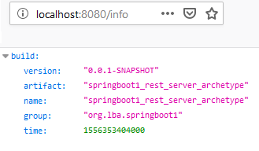
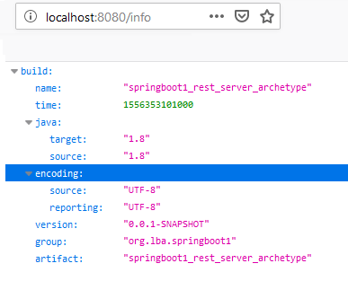
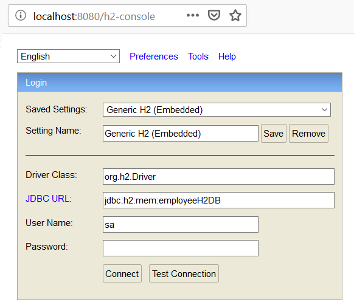
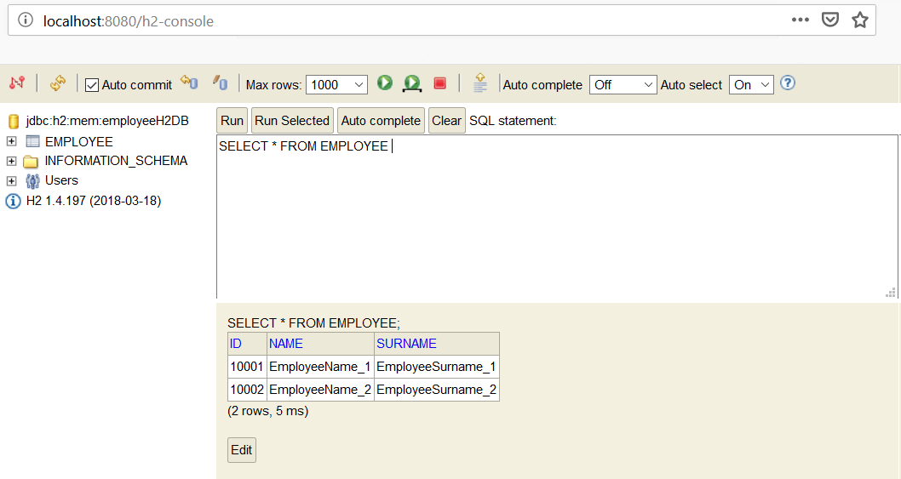

# Project name : springboot1\_rest\_server\_archetype

# Table of Contents

* [Scope](#scope)
* [Getting started](#getting-started)
  * [Inside Eclipse](#inside-eclipse)
  * [Prerequisite](#prerequisite)
    * [Installing](#installing)
* [Running Test](#running-test)
* [Rest service exposed](#rest-service-exposed)
  * [REST Url Endpoints](#rest-url-endpoints)
  * [Spring actuator endpoints](#spring-actuator-endpoints)
* [H2 Configuration](#h2-configuration)
  * [H2 property configuration](#h2-property-configuration)
  * [H2 WEB Console configuration](#h2-web-console-configuration)
  * [H2 schema and data configuration](#h2-schema-and-data-configuration)
* [Built with](#built-with)
* [Useful commands](#useful-commands)
  * [Windows - close task on open port](#windows-close-task-on-open-port)  
  
# Scope

This was a clean **springboot1** microservice that offer a REST API for a CRUD operation on an Employee domain example.  
This project is using the **H2** in-memory database.  

As default configuration this module contains:  

* **springboot1**    : 1.5.20
* In-Memory DataBase : H2

# Getting started

### Inside Eclipse

1) Import this project as **Maven project**

2) On project folder, right click mouse and select:  
**Run As -> Maven Build ...**

3) On **Goals** text box enter the command:

```
spring-boot:run
```

### Prerequisite
* Java version 1.8
* Maven 

### Installing
**None**

# Running Test
All tests are into relate folder: **{project}/scr/test/java** .


# Rest service exposed

This project expose a CRUD endpoints.  
Inside the folder: **REST_API_Invocation/postman** you can find the **Postam** file, configured to test all REST API exposed.

### REST Url Endpoints

| HTTP Verb     | HTTP URL      | Request Body  | Meanings  |  
| ------------- |:-------------:|--------------:|----------:| 
|    POST       | http://localhost:8080/employees/employee         		 |    Please see paragraph  | Create a new employee       							 |  
|    POST       | http://localhost:8080/employees/employee/created 		 |    Please see paragraph  | Create and return the new employee object as JSON 	 | 
|    GET        | http://localhost:8080/employees/                       |       *NONE*             | Get all employees           							 |
|    GET        | http://localhost:8080/employees/employee/{id}          |       *NONE*             | Get employee by Id          							 |  
|    PUT        | http://localhost:8080/employees/employee/{id} 		 |   Please see paragraph   | Update an employee  									 |
|    PUT        | http://localhost:8080/employees/employee/updated/{id}  |   Please see paragraph   | Update and return the updated employee as JSON Object  |
|    DELETE     | http://localhost:8080/employees/employee/{id}   		 |       *NONE*             | Delete an employee by Id   		 					 |  
|    DELETE     | http://localhost:8080/employees/employee/delete/{id}	 |       *NONE*             | Delete an employee by Id and return it as JSON Object  |


#### POST - Create employee / PUT - Update employee
In order to create/update an employee you need a body that represent the *employee* to create/update.
You can find the JSON file representing the body for POST Requests in order to create/update an employee in the folder **REST_API_Invocation**.

| JSon file name     | Description      | 
| ------------------ |:----------------:|
|employee_0.0.1.json | - id<br>- name<br>- surname |


### Spring actuator endpoints

By default **springboot1** framework secure all actuator endpoints, excepts:
* info

In order to access without security, to all endpoint you need to add this properties to your **application.properties** file:

```
management.security.enabled=false
```

In order to use the all of actuator endpoint you need to add to your **application.properties** the following properties:

```
management.endpoints.web.exposure.include=* 
```

#### info 

In order to get GAV information from **/info** endpoint, you need to configure the **spring-boot-maven-plugin** like below:

```
	<build>
		<plugins>
		...
			<plugin>
				<groupId>org.springframework.boot</groupId>
				<artifactId>spring-boot-maven-plugin</artifactId>
				
				<executions>
					<execution>
						<goals>
							<goal>build-info</goal>
						</goals>
					</execution>
				</executions>
				
			</plugin>
			...
		</plugins>
	</build>
```

With this configuration you have some information like:



It's is possible to add additional information, like an example coniguration below:

```
	<build>
		<plugins>
		...
			<plugin>
				<groupId>org.springframework.boot</groupId>
				<artifactId>spring-boot-maven-plugin</artifactId>
				<!-- Additional info configuration -->
				<configuration>
					<additionalProperties>
						<encoding.source>UTF-8</encoding.source>
						<encoding.reporting>UTF-8</encoding.reporting>
						<java.source>${maven.compiler.source}</java.source>
						<java.target>${maven.compiler.target}</java.target>
					</additionalProperties>
				</configuration>
				<!-- Standard info configuration -->
				<executions>
					<execution>
						<goals>
							<goal>build-info</goal>
						</goals>
					</execution>
				</executions>
			</plugin>
			...
		</plugins>
	</build>
```

With this configuration you have some information like:



#### shutdown

In order to enable the shutdown endpoint, you need to add these properties to your **application.properties** :

```
management.endpoints.web.exposure.include=*
management.endpoint.shutdown.enabled=true
```

* Note: the shutdown endpoint needs to be invoked with *POST* request, you can invoke it by curl command:

```	
curl -X POST localhost:port/actuator/shutdown
```

As example:
C:\Users\xxxxx>curl -X POST localhost:8080/actuator/shutdown
{"message":"Shutting down, bye..."}

# H2 Configuration

## H2 property configuration

In order to configure the H2 in-memory configuration you need to add these properties to your **application.properties**, or modify based on your needs.

```
spring.datasource.url=jdbc:h2:mem:employeeH2DB  
spring.datasource.driverClassName=org.h2.Driver  
spring.datasource.username=sa  
spring.datasource.password=  
spring.jpa.hibernate.ddl-auto=update  
```

## H2 WEB Console configuration

In order to use the H2 web console you need to add this configuration into your **application.properties** :

```
spring.h2.console.enabled=true
```



As example:
http://localhost:8080/h2-console

* Note: remember to:
1. Inside the inputbox *JDBC URL* use the **spring.datasource.url** you have used before;
2. Use the *username* and *password* you have configured before;

You can customize the H2 web configuration, as example:

```
spring.h2.console.enabled=true
spring.h2.console.path=/console
spring.h2.console.settings.trace=false
spring.h2.console.settings.web-allow-others=false
```
## H2 schema and data configuration
With H2 embedded configuration, you can simply add a sql files to have your database data populated an ready to go.

You need to add under the path ${project.basedir}/scr/main/resources the following file:
* **schema.sql**: this file represent your database model;
* **data.sql**  : this file represent the data of your database model;  

An image that show the successful load of data into H2 database:



# Built with
* [Java SDK Version](http://www.oracle.com/technetwork/java/javase/downloads/index.html) - 1.8
* [Maven](https://maven.apache.org/) - Dependency Management
* [Spring](https://spring.io/) - Spring framework

# Useful commands

## Windows - close task on open port
netstat -ano | findstr :8080  
taskkill /PID 6152 /F


